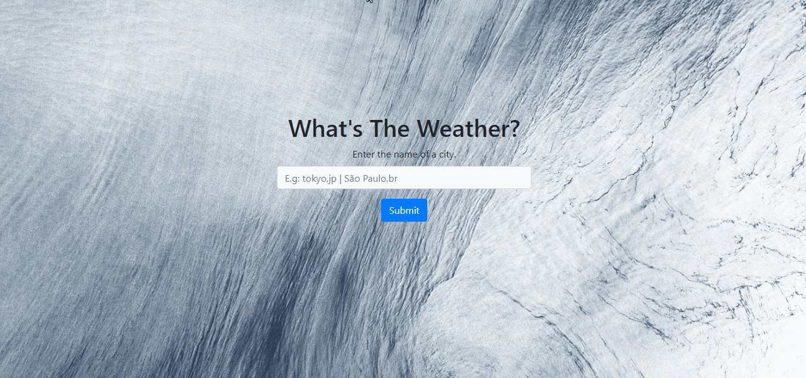
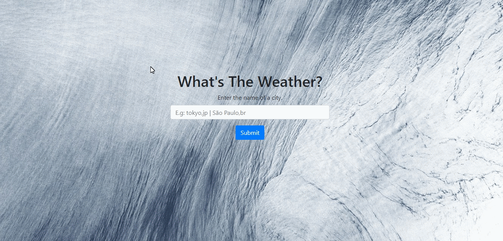

WEATHER WEBPAGE
===============

This project is based on one of the Open Weather Map's API called <em>Current weather data</em>.  
As the name suggests, it returns the current weather information of any location on Earth.  
In this project, the city name is the parameter to define the area to get the information from.  
Before using the API in a project, it is needed to sign up, for free. After that, an API key to use one of the weather API is provided.  
With this API key on hand, it is possible to add to your project an URL that returns a JSON format array with the climate info.  

---

The files of this project are:

	*
gifs/ <em>This is folder with the gifs of the webpage</em>.
	
	*
APIpasswordKey.php <em>This file contains the API key. For safety, here is just a sample. Go to <a href="https://openweathermap.org/">OpenWeatherMap</a> to get yours.</em>

	*
background.jpg <em>This is the image used in the background. It was downloaded from Unsplash. According to them: Unsplash photos are made to be used freely. Check it out: <a href="https://unsplash.com/license">Unsplash</a>.</em>

	*
index.php <em>It's an HTML file, also is the main file of the project. It contains the title, the form(input and submit button), and the alert of the results of the consult.</em> `In the bootstrap folder, there are explanations about how these were done.`

	*
README.md <em>This is the readme</em>.

	*
style.css <em>The background image was applied by these files. Also, the style of the body, image, container, and the margin of the weather message was done here.</em>

	*
weatherApi.php <em>This is where the API goes. The explanation of this process is below</em>.

---
<h2>How Does it work?</h2>

The process starts with the **index.php** file, where the styles are applied(_style.php file_), and the users may type a name of a city and click on the submit button.  
After that, in the **weatherAPI.php** file, the _APIpasswordkey.php_ is included, and an if statements verify if a city name was typed, and if it does, its proceeds; else, an error message it will be sent back to the **index.php** file. The next step, if there is a city name input, it's to pass the API URL(_with the API key of the _APIpasswordkey.php_ file_) to a variable, which will hold the weather information as JSON format.  
Next, this variable is decoded in an array, that will be verified if the city typed has a valid code. If it does, then some information will be appended to a weather variable and sent back to the index file. Otherwise, an error message is sent back to the index file.
Back to the index file, in a PHP tag, an if statement will check if there is valid weather information of the city typed or if the API couldn't find that city. 

---
<h2> Check it out:</h2>

<h4>City name correct/found:</h4>

<h4>Not working</h4>

Click <a href="http://ldkwebdev-api-com.stackstaging.com/weather/">**here**</a> to try for yourself!

